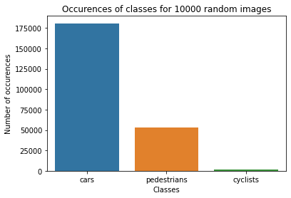
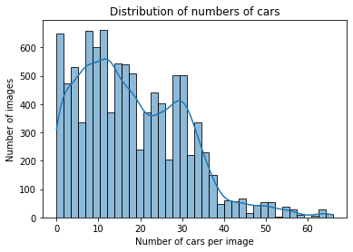
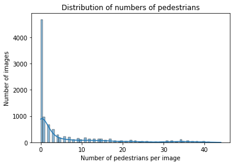
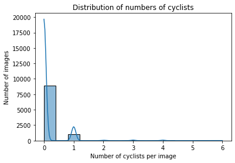
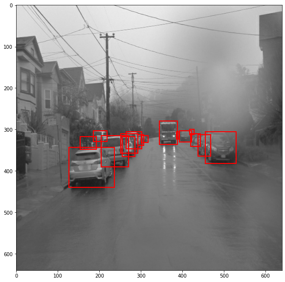
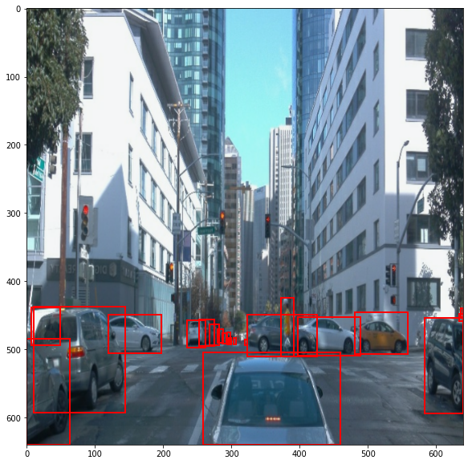
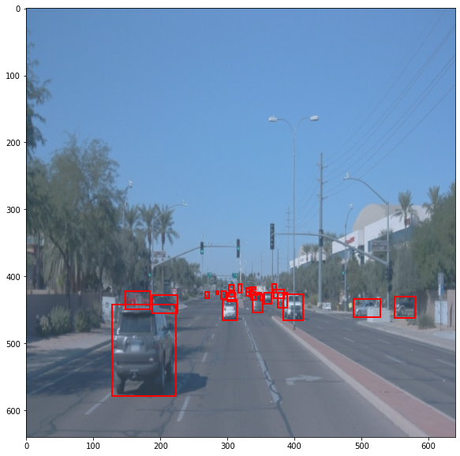

# Object Detection in an Urban Environment

## Data

For this project, we will be using data from the [Waymo Open dataset](https://waymo.com/open/).

[OPTIONAL] - The files can be downloaded directly from the website as tar files or from the [Google Cloud Bucket](https://console.cloud.google.com/storage/browser/waymo_open_dataset_v_1_2_0_individual_files/) as individual tf records. We have already provided the data required to finish this project in the workspace, so you don't need to download it separately.

## Structure

### Data

The data you will use for training, validation and testing is organized as follow:
```
/home/workspace/data/waymo
    - training_and_validation - contains 97 files to train and validate your models
    - train: contain the train data (empty to start)
    - val: contain the val data (empty to start)
    - test - contains 3 files to test your model and create inference videos
```

The `training_and_validation` folder contains file that have been downsampled: we have selected one every 10 frames from 10 fps videos. The `testing` folder contains frames from the 10 fps video without downsampling.

You will split this `training_and_validation` data into `train`, and `val` sets by completing and executing the `create_splits.py` file.

### Experiments
The experiments folder will be organized as follow:
```
experiments/
    - pretrained_model/
    - exporter_main_v2.py - to create an inference model
    - model_main_tf2.py - to launch training
    - reference/ - reference training with the unchanged config file
    - experiment0/ - create a new folder for each experiment you run
    - experiment1/ - create a new folder for each experiment you run
    - experiment2/ - create a new folder for each experiment you run
    - label_map.pbtxt
    ...
```

## Prerequisites

### Local Setup

For local setup if you have your own Nvidia GPU, you can use the provided Dockerfile and requirements in the [build directory](./build).

Follow [the README therein](./build/README.md) to create a docker container and install all prerequisites.

### Download and process the data

**Note:** ”If you are using the classroom workspace, we have already completed the steps in the section for you. You can find the downloaded and processed files within the `/home/workspace/data/preprocessed_data/` directory. Check this out then proceed to the **Exploratory Data Analysis** part.

The first goal of this project is to download the data from the Waymo's Google Cloud bucket to your local machine. For this project, we only need a subset of the data provided (for example, we do not need to use the Lidar data). Therefore, we are going to download and trim immediately each file. In `download_process.py`, you can view the `create_tf_example` function, which will perform this processing. This function takes the components of a Waymo Tf record and saves them in the Tf Object Detection api format. An example of such function is described [here](https://tensorflow-object-detection-api-tutorial.readthedocs.io/en/latest/training.html#create-tensorflow-records). We are already providing the `label_map.pbtxt` file.

You can run the script using the following command:
```
python download_process.py --data_dir {processed_file_location} --size {number of files you want to download}
```

You are downloading 100 files (unless you changed the `size` parameter) so be patient! Once the script is done, you can look inside your `data_dir` folder to see if the files have been downloaded and processed correctly.

### Classroom Workspace

In the classroom workspace, every library and package should already be installed in your environment. You will NOT need to make use of `gcloud` to download the images.

## Instructions

### Exploratory Data Analysis

You should use the data already present in `/home/workspace/data/waymo` directory to explore the dataset! This is the most important task of any machine learning project. To do so, open the `Exploratory Data Analysis` notebook. In this notebook, your first task will be to implement a `display_instances` function to display images and annotations using `matplotlib`. This should be very similar to the function you created during the course. Once you are done, feel free to spend more time exploring the data and report your findings. Report anything relevant about the dataset in the writeup.

Keep in mind that you should refer to this analysis to create the different spits (training, testing and validation).


### Create the training - validation splits
In the class, we talked about cross-validation and the importance of creating meaningful training and validation splits. For this project, you will have to create your own training and validation sets using the files located in `/home/workspace/data/waymo`. The `split` function in the `create_splits.py` file does the following:
* create three subfolders: `/home/workspace/data/train/`, `/home/workspace/data/val/`, and `/home/workspace/data/test/`
* split the tf records files between these three folders by symbolically linking the files from `/home/workspace/data/waymo/` to `/home/workspace/data/train/`, `/home/workspace/data/val/`, and `/home/workspace/data/test/`

Use the following command to run the script once your function is implemented:
```
python create_splits.py --data-dir /home/workspace/data
```

### Edit the config file

Now you are ready for training. As we explain during the course, the Tf Object Detection API relies on **config files**. The config that we will use for this project is `pipeline.config`, which is the config for a SSD Resnet 50 640x640 model. You can learn more about the Single Shot Detector [here](https://arxiv.org/pdf/1512.02325.pdf).

First, let's download the [pretrained model](http://download.tensorflow.org/models/object_detection/tf2/20200711/ssd_resnet50_v1_fpn_640x640_coco17_tpu-8.tar.gz) and move it to `/home/workspace/experiments/pretrained_model/`.

We need to edit the config files to change the location of the training and validation files, as well as the location of the label_map file, pretrained weights. We also need to adjust the batch size. To do so, run the following:
```
python edit_config.py --train_dir /home/workspace/data/train/ --eval_dir /home/workspace/data/val/ --batch_size 2 --checkpoint /home/workspace/experiments/pretrained_model/ssd_resnet50_v1_fpn_640x640_coco17_tpu-8/checkpoint/ckpt-0 --label_map /home/workspace/experiments/label_map.pbtxt
```
A new config file has been created, `pipeline_new.config`.

### Training

You will now launch your very first experiment with the Tensorflow object detection API. Move the `pipeline_new.config` to the `/home/workspace/experiments/reference` folder. Now launch the training process:
* a training process:
```
python experiments/model_main_tf2.py --model_dir=experiments/reference/ --pipeline_config_path=experiments/reference/pipeline_new.config
```
Once the training is finished, launch the evaluation process:
* an evaluation process:
```
python experiments/model_main_tf2.py --model_dir=experiments/reference/ --pipeline_config_path=experiments/reference/pipeline_new.config --checkpoint_dir=experiments/reference/
```

**Note**: Both processes will display some Tensorflow warnings, which can be ignored. You may have to kill the evaluation script manually using
`CTRL+C`.

To monitor the training, you can launch a tensorboard instance by running `python -m tensorboard.main --logdir experiments/reference/`. You will report your findings in the writeup.

### Improve the performances

Most likely, this initial experiment did not yield optimal results. However, you can make multiple changes to the config file to improve this model. One obvious change consists in improving the data augmentation strategy. The [`preprocessor.proto`](https://github.com/tensorflow/models/blob/master/research/object_detection/protos/preprocessor.proto) file contains the different data augmentation method available in the Tf Object Detection API. To help you visualize these augmentations, we are providing a notebook: `Explore augmentations.ipynb`. Using this notebook, try different data augmentation combinations and select the one you think is optimal for our dataset. Justify your choices in the writeup.

Keep in mind that the following are also available:
* experiment with the optimizer: type of optimizer, learning rate, scheduler etc
* experiment with the architecture. The Tf Object Detection API [model zoo](https://github.com/tensorflow/models/blob/master/research/object_detection/g3doc/tf2_detection_zoo.md) offers many architectures. Keep in mind that the `pipeline.config` file is unique for each architecture and you will have to edit it.

**Important:** If you are working on the workspace, your storage is limited. You may to delete the checkpoints files after each experiment. You should however keep the `tf.events` files located in the `train` and `eval` folder of your experiments. You can also keep the `saved_model` folder to create your videos.


### Creating an animation
#### Export the trained model
Modify the arguments of the following function to adjust it to your models:

```
python experiments/exporter_main_v2.py --input_type image_tensor --pipeline_config_path experiments/reference/pipeline_new.config --trained_checkpoint_dir experiments/reference/ --output_directory experiments/reference/exported/
```

This should create a new folder `experiments/reference/exported/saved_model`. You can read more about the Tensorflow SavedModel format [here](https://www.tensorflow.org/guide/saved_model).

Finally, you can create a video of your model's inferences for any tf record file. To do so, run the following command (modify it to your files):
```
python inference_video.py --labelmap_path label_map.pbtxt --model_path experiments/reference/exported/saved_model --tf_record_path /data/waymo/testing/segment-12200383401366682847_2552_140_2572_140_with_camera_labels.tfrecord --config_path experiments/reference/pipeline_new.config --output_path animation.gif
```

## Solution

### Project overview
This repository is for the first project of `Udacity Self Driving Car Engineer Nanodegree`. The goal of the project is **Implementation of an Object Detection** model for self-driving cars. In this project, we will utilize TF object detection API for better detection of objects on road, like cars, pedestrians, and cyclists. We will mainly use ResNet50 trained by [Waymo Open dataset](https://waymo.com/open/) to detect and classify objects. 

### Set up
For local setup if you have your own Nvidia GPU, you can use the provided Dockerfile and requirements in the `build` directory of the starter code.

The instructions below are also contained within the `build` directory of the starter code.
**Requirements**
- NVIDIA GPU with the latest driver installed
- docker / nvidia-docker

**Build**
Build the image with:
```
docker build -t project-dev -f Dockerfile .
```

Create a container with:
```
docker run --gpus all -v <PATH TO LOCAL PROJECT FOLDER>:/app/project/ --network=host -ti project-dev bash
and any other flag you find useful to your system (eg, --shm-size).
```

**Set up**
Once in container, you will need to install gsutil, which you can easily do by running:

```
curl https://sdk.cloud.google.com | bash
```

Once gsutil is installed and added to your path, you can auth using:
```
gcloud auth login
```

**Debug**
- Follow this tutorial if you run into any issue with the installation of the TF Object Detection API.

### Dataset
<!-- This section should contain a quantitative and qualitative description of the dataset. It should include images, charts and other visualizations. -->
In this dataset, we have to fit rectangular bounding boxes to bound the objects in the images, such as cars, pedestrians, and cyclists. Here are some examples of the images in the dataset 
<!-- TODO: put images of dataset-->

Red bounding box denotes cars, blue for pedestrians, and green for cyclists.
Images are taken from different locations (highways/cities), with different weathers (sunny/rainy/foggy), and at different time(days/nights). With these different conditions, some images look clear, bright, while others look blurry, dark. We can see that many of the objects in these images are hardly spotable by human eyes. Thus, it is reasonable to expect that the network will not have perfect performance. However, we should at least obtain a model that can detect and classify the objects nearby.

#### Dataset analysis
From a first glance, it appears that there are more cars than pedestrians and cyclists. Cyclists seem to be barely seen among all the images. Some statistics of the dataset are provided in `Exploratory Data Analysis.ipynb`. There is a class imbalance between cars and pedestrians, cyclists, which is demonstrated in the following plot of number of total occurrences of objects of different classes in 10000 images randomly taken from the dataset.
<!-- TODO: put images of count of cars, peds, cycs-->
 
Here are also histograms demonstrating distributions of cars, pedestrians, and cyclists in these 10000 images. From these plots, we can see that there is no cyclist in over 85% of the images in the dataset
  

#### Cross validation
<!-- This section should detail the cross validation strategy and justify your approach. -->
Ideal ML algorithm should generalize well to larger unknown environment beyond that of training datasets. Here, due to the computational expense of CNN, we choose the simplest cross validation method by splitting the datasets into 75% training, 15% validation, 10% testing. We are using 0.75 : 0.15 as the ratio of training and validation because we only have 100 tfrecord samples. 75% ensures that we have enough data for training, and it normally will not lead to an issue of overfitting. Meanwhile, we have 10% of data for testing to check the error rates of the model on unseen data and if the model generalizes well.

### Training
#### Reference experiment
The reference model is ResNet50 without augumentaion (see details of model parameters in `experiments/reference/pipeline_new.config`). Training loss of the model is shown as follows:

Precision:
 
Recall:

From the plots, it is obvious that both losses are very noisy, especially localization loss. And localization loss does not seem to converge. Precision and Recall are extremly low and the model can barely detect and classify any object. 

#### Improve on the reference
1. Increase the **batch size** from `2` to `8`: batch size of `2` and `4` are too low for regular training of a large-size CNN like ResNet50. The detailed pipeline is in `experiments/experiment1/pipeline_new.config`. The results are as follows.
- Training and validation loss of the model

- Precision

- Recall

We see significant improvement in model loss, and Precision-Recall rate. This is a indication of better performance. 
A video based on the model inferences for `data/test/segment-12200383401366682847_2552_140_2572_140_with_camera_labels.tfrecord`. We can see the model is now able to detect and classify objects nearby, but not the smaller objects far away.


2. **Augmentation**
- 0.2 probability of grayscale conversion: this could better simulate rainy or foggy weather conditions, or area under huge shadow

- contrast value from 0.5 to 1.0: this added more variation to edge detectability

- brightness adjusted to 0.3: this could better simulate very sunny day with very bright light
 
More details of the agumentation can be found in `Explore augmentations.ipynb`, and the detailed pipeline is in `experiments/experiment2/pipeline_new.config`. However, due to limitation of memory in the VM workspace, we have to resort to batch size of `2`, and step size of `2500`, which is very likely not enough for the network to converge. As a result, the performance does improve a lot, compared with reference model.

The results are as follows.
- Training and validation loss of the model

- Precision

- Recall

Althought we see a decrease in model loss, increase in precision and recall is tiny. The inference result is almost the same as that of the reference model, which barely detect anything. Thus, there is no pointing showing the inference video here.  

By investigating the model on the test dataset, we can see the model is not goot at detecting small objects in the images. As cyclists only appear very scarcely in the datasets, we can expect the model to struggle to detect cyclists. In the future, improvements can be made in using higher resolution data for training, and sampling with more images with cyclist. More importantly, we want train for more steps with lower learning rate so that the model converges, provided that computers have larger computational resources and memories.
